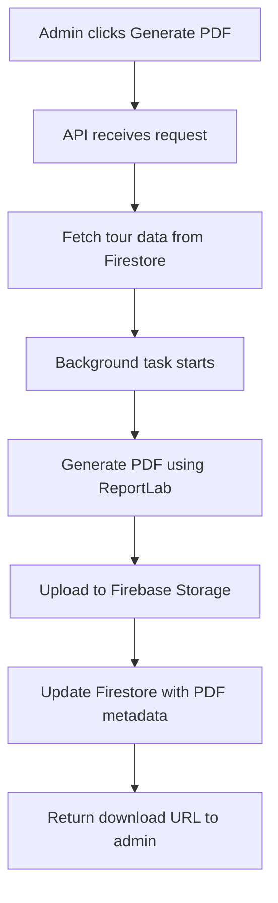
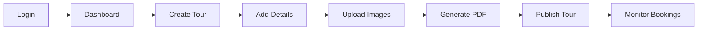

# 🌍 Travel Admin Management System

A comprehensive travel package management system built with **FastAPI** and **Firebase**, featuring advanced tour creation, itinerary management, image handling, trip vibe ratings, and automated PDF generation.

## 📋 Table of Contents

- [Overview](#overview)
- [Features](#features)
- [System Architecture](#system-architecture)
- [Technology Stack](#technology-stack)
- [Database Structure](#database-structure)
- [Trip Vibe Rating System](#trip-vibe-rating-system)
- [PDF Generation System](#pdf-generation-system)
- [API Documentation](#api-documentation)
- [Installation & Setup](#installation--setup)
- [Usage Guide](#usage-guide)
- [Firebase Configuration](#firebase-configuration)
- [Admin Panel Features](#admin-panel-features)
- [Customer Features](#customer-features)
- [Contributing](#contributing)

## 🎯 Overview

This Travel Admin Management System is designed for travel agencies to create, manage, and distribute comprehensive tour packages. The system provides a complete solution for managing destinations, creating detailed itineraries, handling multimedia content, and generating professional documentation.

### Key Highlights:
- **Multi-step Tour Creation** with progressive form interface
- **Trip Vibe Rating System** with emoji visualization (🏔️ Adventure, 🕉️ Spiritual, 😎 Chill, 🌿 Nature, 🏛️ Cultural)
- **Advanced Image Management** with automatic optimization and CDN delivery
- **Automated PDF Generation** for itineraries, brochures, and booking forms
- **Real-time Updates** with Firebase integration
- **Responsive Admin Dashboard** for comprehensive tour management

## ✨ Features

### 🔧 Admin Features
- **Tour Package Creation** - Multi-step form with validation
- **Day-wise Itinerary Builder** - Detailed activity planning
- **Image Upload & Management** - Cover, gallery, and day-specific images
- **Trip Vibe Rating** - 5-category rating system with emoji visualization
- **PDF Document Generation** - Automated itinerary and brochure creation
- **Pricing Management** - Base pricing, seasonal rates, group discounts
- **Content Management** - Inclusions, exclusions, essential information
- **Real-time Dashboard** - Analytics and tour performance tracking
- **Template System** - Pre-built templates for different tour types

### 👥 Customer Features
- **Tour Discovery** - Filter by trip vibes, price, duration
- **Detailed Itinerary View** - Day-by-day breakdown with images
- **PDF Downloads** - Comprehensive itinerary documents
- **Visual Trip Vibes** - Emoji-based tour personality display
- **Booking System** - Integrated booking with payment processing
- **Mobile Responsive** - Optimized for all devices

## 🏗️ System Architecture

```
┌─────────────────────────────────────────────────────────────┐
│                    Frontend (Next.js)                      │
│  ┌─────────────────┐  ┌─────────────────┐  ┌──────────────┐│
│  │  Admin Panel    │  │  Customer Site  │  │  Mobile App  ││
│  └─────────────────┘  └─────────────────┘  └──────────────┘│
└─────────────────────────────────────────────────────────────┘
                               │
                               ▼
┌─────────────────────────────────────────────────────────────┐
│                  Backend API (FastAPI)                     │
│  ┌──────────────┐  ┌──────────────┐  ┌─────────────────────┐│
│  │ Tour Mgmt    │  │ Image Mgmt   │  │ PDF Generation      ││
│  │ APIs         │  │ APIs         │  │ Service             ││
│  └──────────────┘  └──────────────┘  └─────────────────────┘│
└─────────────────────────────────────────────────────────────┘
                               │
                               ▼
┌─────────────────────────────────────────────────────────────┐
│                    Firebase Services                       │
│  ┌──────────────┐  ┌──────────────┐  ┌─────────────────────┐│
│  │  Firestore   │  │   Storage    │  │   Authentication    ││
│  │  Database    │  │   (Images)   │  │   (Admin/Users)     ││
│  └──────────────┘  └──────────────┘  └─────────────────────┘│
└─────────────────────────────────────────────────────────────┘
```

## 🛠️ Technology Stack

### Backend
- **FastAPI** - High-performance Python web framework
- **Firebase Admin SDK** - Database and storage integration
- **Pydantic** - Data validation and settings management
- **ReportLab** - PDF generation library
- **Pillow (PIL)** - Image processing and optimization
- **python-multipart** - File upload handling

### Database & Storage
- **Firestore** - NoSQL document database
- **Firebase Storage** - Cloud storage with CDN
- **Firebase Authentication** - User and admin authentication

### Frontend (Optional)
- **Next.js 15** - React framework for admin panel
- **Tailwind CSS** - Utility-first CSS framework
- **Lucide React** - Icon library

## 🗄️ Database Structure

### Firestore Collections

```javascript
travel-admin-db/
├── destinations/           // Travel destinations
├── tours/                 // Main tour packages
├── tour_itinerary/        // Day-wise itinerary data
├── tour_images/           // Image metadata and URLs
├── tour_inclusions/       // What's included/excluded
├── tour_essentials/       // Things to carry/know
├── tour_documents/        // PDF document metadata
├── categories/            // Tour categories
├── bookings/             // Customer bookings
└── admin_users/          // Admin user management
```

### Sample Tour Document Structure

```json
{
  "id": "tour_001",
  "title": "Royal Rajasthan Escape",
  "slug": "royal-rajasthan-escape",
  "destination_id": "dest_rajasthan",
  "category": "domestic",
  "overview": "Experience the royal heritage of Rajasthan...",
  "duration": {
    "days": 7,
    "nights": 6
  },
  "pricing": {
    "base_price": 18499,
    "currency": "INR",
    "seasonal_pricing": [...],
    "group_discounts": [...]
  },
  "trip_vibes": {
    "adventure_level": 2,
    "spiritual_level": 4,
    "chill_level": 3,
    "nature_level": 2,
    "cultural_level": 5
  },
  "difficulty_level": "Easy",
  "status": "published",
  "featured": true,
  "created_at": "2024-01-01T00:00:00Z"
}
```

## 🎭 Trip Vibe Rating System

### 5-Category Rating System

| Category | Emoji | Description | Scale |
|----------|-------|-------------|-------|
| **Adventure** | 🏔️ | Physical activities and thrill | 1-5 |
| **Spiritual** | 🕉️ | Religious and mindful experiences | 1-5 |
| **Chill** | 😎 | Relaxation and leisure level | 1-5 |
| **Nature** | 🌿 | Natural environment exposure | 1-5 |
| **Cultural** | 🏛️ | Local culture immersion | 1-5 |

### Visual Representation
```
Royal Rajasthan Escape:
🏔️🏔️⚪⚪⚪ Adventure (2/5) - Light camel rides
🕉️🕉️🕉️🕉️⚪ Spiritual (4/5) - Temple visits, traditions  
😎😎😎⚪⚪ Chill (3/5) - Balanced pace
🌿🌿⚪⚪⚪ Nature (2/5) - Some desert landscapes
🏛️🏛️🏛️🏛️🏛️ Cultural (5/5) - Deep cultural immersion
```

### Implementation
```python
class TripVibes(BaseModel):
    adventure_level: int = Field(ge=1, le=5)
    spiritual_level: int = Field(ge=1, le=5)
    chill_level: int = Field(ge=1, le=5)
    nature_level: int = Field(ge=1, le=5)
    cultural_level: int = Field(ge=1, le=5)
```

## 📄 PDF Generation System

### Document Types

1. **Detailed Itinerary PDF**
   - Day-by-day schedule with timings
   - Activity details and locations
   - Accommodation and meal information
   - Transportation arrangements
   - Things to carry checklist
   - Emergency contacts

2. **Tour Brochure PDF**
   - Tour highlights and overview
   - Pricing information
   - Trip vibe visualization
   - Gallery images
   - Booking information

3. **Booking Form PDF**
   - Customer details form
   - Tour selection and pricing
   - Terms and conditions
   - Payment information

### Template System

```python
# Available Templates by Tour Type
templates = {
    "adventure": {
        "design": "Bold, dynamic layout",
        "features": ["Equipment checklist", "Safety instructions", "Weather warnings"]
    },
    "spiritual": {
        "design": "Calm, serene colors",
        "features": ["Meditation schedules", "Dress codes", "Religious customs"]
    },
    "cultural": {
        "design": "Heritage-themed",
        "features": ["Historical information", "Cultural etiquette", "Language tips"]
    },
    "beach": {
        "design": "Relaxed, vibrant",
        "features": ["Leisure activities", "Dining options", "Entertainment info"]
    }
}
```

### PDF Generation Flow



## 🔌 API Documentation

### Authentication Endpoints
```
POST   /admin/auth/login           # Admin login
POST   /admin/auth/refresh         # Refresh JWT token
POST   /admin/auth/logout          # Admin logout
GET    /admin/auth/profile         # Get admin profile
```

### Tour Management Endpoints
```
GET    /admin/tours                # List tours with filters
POST   /admin/tours                # Create new tour
GET    /admin/tours/{tour_id}      # Get tour details
PUT    /admin/tours/{tour_id}      # Update tour
DELETE /admin/tours/{tour_id}      # Delete tour
PATCH  /admin/tours/{tour_id}/status # Update tour status
```

### Itinerary Management
```
POST   /admin/tours/{tour_id}/itinerary          # Add itinerary day
PUT    /admin/tours/{tour_id}/itinerary/{day_id} # Update specific day
DELETE /admin/tours/{tour_id}/itinerary/{day_id} # Delete day
POST   /admin/tours/{tour_id}/itinerary/reorder  # Reorder days
```

### Image Management
```
POST   /admin/upload/image                    # Upload single image
POST   /admin/upload/bulk                     # Upload multiple images
DELETE /admin/images/{image_id}               # Delete image
PUT    /admin/images/{image_id}               # Update image metadata
GET    /admin/tours/{tour_id}/images          # Get all tour images
```

### PDF Management
```
POST   /admin/tours/{tour_id}/generate-pdf    # Generate PDF document
GET    /admin/tours/{tour_id}/pdf-status      # Check PDF generation status
GET    /admin/tours/{tour_id}/download-pdf    # Download generated PDF
DELETE /admin/tours/{tour_id}/pdf/{type}      # Delete PDF document
GET    /admin/tours/{tour_id}/pdf-dashboard   # PDF management dashboard
```

### Public API Endpoints
```
GET    /api/tours                    # Public tour listing
GET    /api/tours/{tour_id}          # Public tour details
GET    /api/destinations             # Available destinations
POST   /api/bookings                 # Create booking
GET    /api/tours/search             # Search tours with filters
```

## 🚀 Installation & Setup

### Prerequisites
- Python 3.8+
- Firebase Project
- Google Cloud Service Account

### 1. Clone Repository
```bash
git clone https://github.com/your-repo/travel-admin-system.git
cd travel-admin-system
```

### 2. Create Virtual Environment
```bash
python -m venv venv
source venv/bin/activate  # On Windows: venv\Scripts\activate
```

### 3. Install Dependencies
```bash
pip install -r requirements.txt
```

### 4. Firebase Setup
```bash
# Download Firebase service account key
# Place it in the root directory as 'serviceAccountKey.json'
```

### 5. Environment Variables
Create `.env` file:
```env
FIREBASE_CREDENTIALS_PATH=./serviceAccountKey.json
FIREBASE_STORAGE_BUCKET=your-project-storage-bucket
JWT_SECRET_KEY=your-secret-key
ENVIRONMENT=development
```

### 6. Run the Application
```bash
uvicorn main:app --reload --host 0.0.0.0 --port 8000
```

### 7. Access the API
- **API Documentation**: http://localhost:8000/docs
- **Admin Panel**: http://localhost:8000/admin
- **Health Check**: http://localhost:8000/health

## 📖 Usage Guide

### Creating a New Tour Package

1. **Basic Information**
   ```python
   # Step 1: Create tour with basic info
   tour_data = {
       "title": "Royal Rajasthan Escape",
       "destination_id": "dest_rajasthan",
       "category": "domestic",
       "overview": "Experience royal heritage...",
       "duration": {"days": 7, "nights": 6},
       "difficulty_level": "Easy"
   }
   ```

2. **Set Trip Vibes**
   ```python
   # Step 2: Configure trip personality
   trip_vibes = {
       "adventure_level": 2,
       "spiritual_level": 4,
       "chill_level": 3,
       "nature_level": 2,
       "cultural_level": 5
   }
   ```

3. **Add Itinerary**
   ```python
   # Step 3: Create day-wise itinerary
   itinerary = [
       {
           "day_number": 1,
           "day_title": "Arrival in Jaipur",
           "activities": {
               "morning": "Airport pickup",
               "afternoon": "City Palace tour",
               "evening": "Hawa Mahal visit"
           },
           "meals": {
               "breakfast": {"included": true, "location": "Hotel"},
               "lunch": {"included": true, "location": "Local Restaurant"}
           }
       }
   ]
   ```

4. **Upload Images**
   ```python
   # Step 4: Add tour images
   # Upload cover image, gallery images, day-specific images
   ```

5. **Generate PDF**
   ```python
   # Step 5: Create downloadable itinerary
   # System automatically generates professional PDF
   ```

### Admin Dashboard Workflow



## ⚙️ Firebase Configuration

### Firestore Security Rules
```javascript
rules_version = '2';
service cloud.firestore {
  match /databases/{database}/documents {
    // Admin access
    match /{document=**} {
      allow read, write: if request.auth != null && 
        get(/databases/$(database)/documents/admin_users/$(request.auth.uid)).data.role == 'admin';
    }
    
    // Public read for published tours
    match /tours/{tourId} {
      allow read: if resource.data.status == 'published';
    }
  }
}
```

### Storage Security Rules
```javascript
rules_version = '2';
service firebase.storage {
  match /b/{bucket}/o {
    match /tours/{tourId}/{allPaths=**} {
      allow read: if true;
      allow write: if request.auth != null && 
        firestore.get(/databases/(default)/documents/admin_users/$(request.auth.uid)).data.role == 'admin';
    }
  }
}
```

## 🎛️ Admin Panel Features

### Dashboard Overview
- **Tour Statistics** - Total tours, published, drafts
- **Booking Analytics** - Revenue, conversion rates
- **Popular Destinations** - Performance metrics
- **Recent Activity** - Latest tours and bookings

### Tour Management Interface
- **Multi-tab Form** - Progressive tour creation
- **Drag & Drop** - Image upload and reordering
- **Real-time Preview** - See how tour appears to customers
- **Bulk Actions** - Publish/unpublish multiple tours
- **Search & Filter** - Find tours quickly

### Content Management Tools
- **Rich Text Editor** - WYSIWYG editing for descriptions
- **Template Library** - Reusable content blocks
- **Version Control** - Track changes and revisions
- **SEO Optimization** - Meta tags and URL management

## 👨‍💼 Customer Features

### Tour Discovery
- **Advanced Filters** - By vibe, price, duration, destination
- **Trip Vibe Visualization** - Emoji-based tour personality
- **Image Galleries** - High-quality tour photos
- **Interactive Maps** - Tour routes and locations

### Booking Experience
- **Detailed Itinerary** - Day-by-day breakdown
- **PDF Downloads** - Comprehensive tour documents
- **Real-time Availability** - Live booking status
- **Secure Payments** - Integrated payment processing

## 📊 Performance & Analytics

### System Performance
- **Response Times** - Average API response < 200ms
- **Image Loading** - CDN delivery < 100ms
- **PDF Generation** - Background processing 2-3 minutes
- **Database Queries** - Optimized with proper indexing

### Analytics Tracking
- **Tour Performance** - Views, bookings, conversion rates
- **Popular Destinations** - Trending locations
- **Customer Preferences** - Trip vibe analytics
- **Revenue Metrics** - Sales and growth tracking

## 🔐 Security Features

### Authentication & Authorization
- **JWT Tokens** - Secure API authentication
- **Role-based Access** - Admin/super-admin permissions
- **Session Management** - Automatic token refresh
- **Password Security** - Hashed with bcrypt

### Data Protection
- **Input Validation** - Pydantic model validation
- **SQL Injection Prevention** - Parameterized queries
- **File Upload Security** - Type and size validation
- **CORS Configuration** - Restricted cross-origin requests

## 🧪 Testing

### Running Tests
```bash
# Install test dependencies
pip install pytest pytest-asyncio httpx

# Run all tests
pytest

# Run with coverage
pytest --cov=app tests/
```

### Test Categories
- **Unit Tests** - Individual function testing
- **Integration Tests** - API endpoint testing
- **Database Tests** - Firestore operations
- **File Upload Tests** - Image processing validation

## 🚀 Deployment

### Production Deployment Options

1. **Google Cloud Run**
   ```bash
   # Build and deploy
   gcloud run deploy travel-admin-api \
     --source . \
     --platform managed \
     --region us-central1
   ```

2. **Docker Deployment**
   ```bash
   # Build Docker image
   docker build -t travel-admin-api .
   
   # Run container
   docker run -p 8000:8000 travel-admin-api
   ```

3. **Railway/Render Deployment**
   - Connect GitHub repository
   - Set environment variables
   - Deploy with automatic builds

### Environment Configuration
```env
# Production settings
ENVIRONMENT=production
FIREBASE_CREDENTIALS_PATH=/app/credentials.json
FIREBASE_STORAGE_BUCKET=prod-travel-storage
JWT_SECRET_KEY=production-secret-key
ALLOWED_ORIGINS=https://yourdomain.com
```

## 📈 Scaling Considerations

### Database Optimization
- **Indexing Strategy** - Optimize frequently queried fields
- **Data Partitioning** - Separate large collections
- **Caching Layer** - Redis for frequently accessed data
- **Connection Pooling** - Efficient database connections

### Performance Optimization
- **CDN Integration** - CloudFlare for static assets
- **Image Optimization** - WebP format conversion
- **Background Tasks** - Celery for heavy operations
- **Load Balancing** - Multiple server instances

## 🤝 Contributing

### Development Workflow
1. Fork the repository
2. Create feature branch (`git checkout -b feature/amazing-feature`)
3. Commit changes (`git commit -m 'Add amazing feature'`)
4. Push to branch (`git push origin feature/amazing-feature`)
5. Open Pull Request

### Code Standards
- **PEP 8** - Python style guide compliance
- **Type Hints** - Full type annotation
- **Documentation** - Comprehensive docstrings
- **Testing** - Minimum 80% code coverage

## 📄 License

This project is licensed under the MIT License - see the [LICENSE](LICENSE) file for details.

## 🆘 Support

### Documentation
- **API Docs**: `/docs` endpoint (Swagger UI)
- **ReDoc**: `/redoc` endpoint (Alternative docs)
- **Postman Collection**: Available in `/docs` folder

### Community & Support
- **GitHub Issues**: Bug reports and feature requests
- **Discussions**: General questions and community support
- **Email Support**: tech-support@yourcompany.com

---

## 📞 Contact Information

**Development Team**
- **Email**: dev-team@yourcompany.com
- **GitHub**: https://github.com/your-organization
- **Documentation**: https://docs.yourcompany.com

**Business Inquiries**
- **Email**: business@yourcompany.com
- **Phone**: +1 (555) 123-4567
- **Website**: https://www.yourcompany.com

---

*Built with ❤️ for the travel industry*